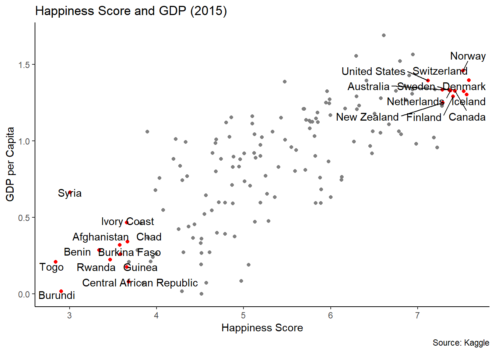
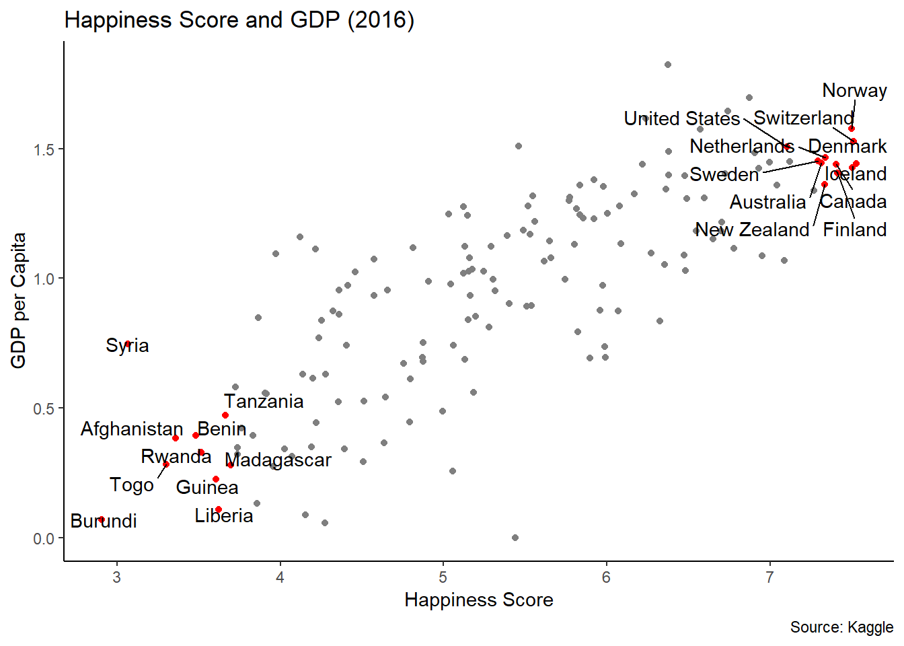
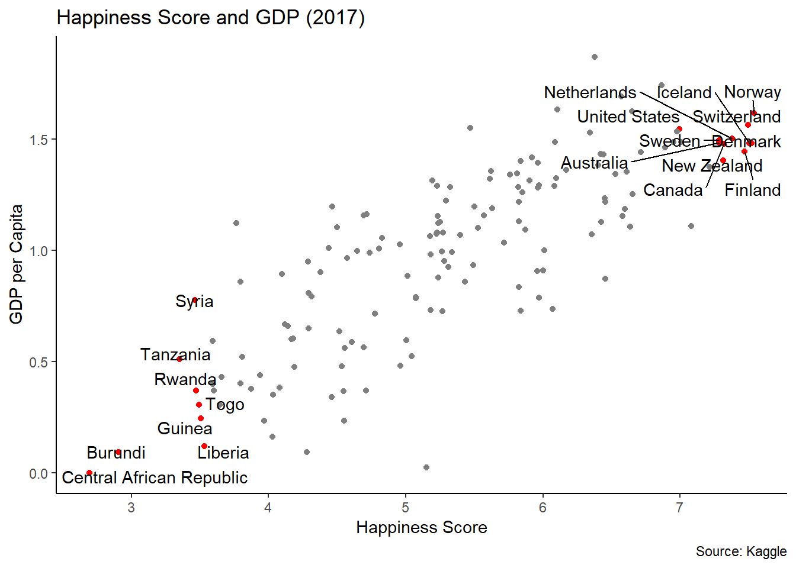

<!-- README.md is generated from README.Rmd. Please edit that file -->

``` r
library(ggplot2)
library(tidyverse)
library(dplyr)
library(ggrepel)
```

``` r
Happy_GDP <- function(data, countries) {
  rownames(data) <- data$Country
  happytop10 = rownames(data[data$Happiness.Rank < 11 | data$Happiness.Rank > 147 ,])
  countries = c("United States", happytop10)
  
  ix_label = which(data$Country %in% countries)
  
  data$Country <- ""
  data$Country[ix_label] <- rownames(data)[ix_label]
  
  ggplot(data, aes(x=Happiness.Score, y=Economy..GDP.per.Capita., label = Country)) +
    geom_point(color = ifelse(data$Country == "", "grey50", "red")) +
    geom_text_repel(point.padding = NA) +
    theme_classic()
}
```






